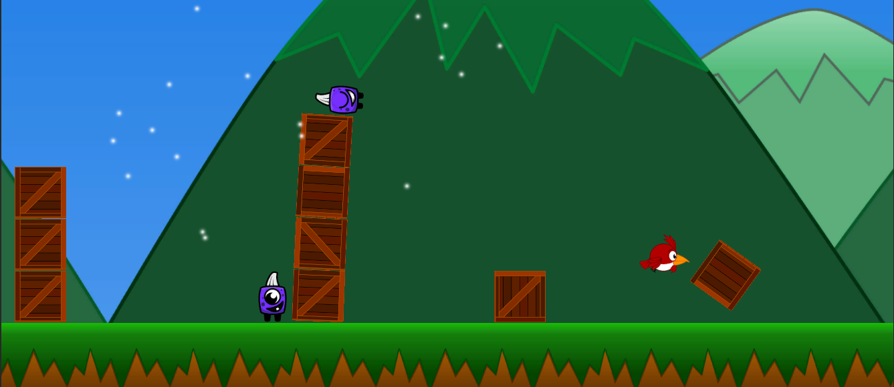
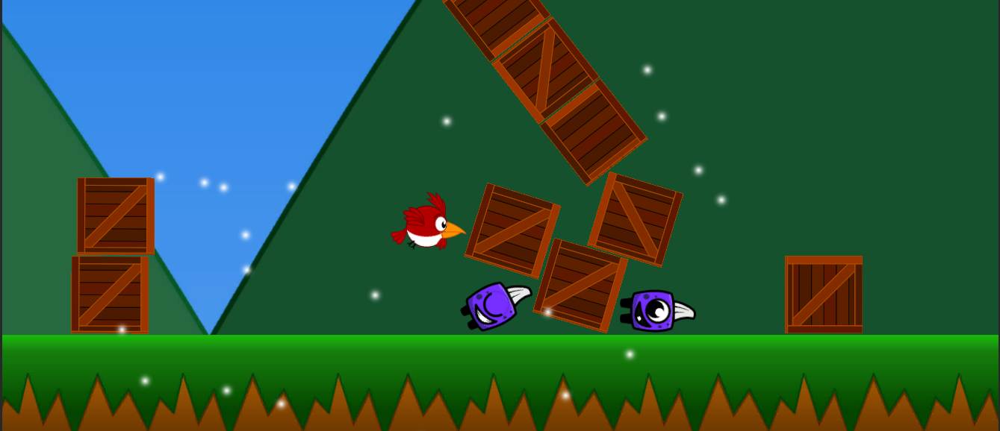
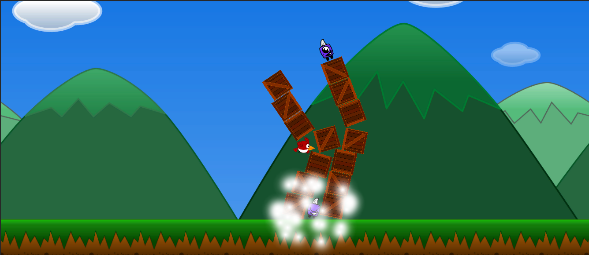
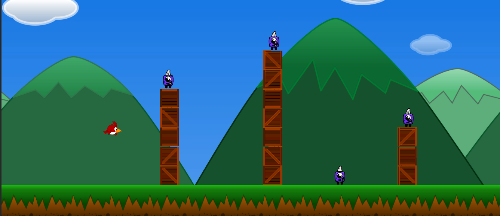

# NoisyBirds

Welcome to the Noisy Birds Game! This is a simple 2D game where you, as a player, need to hunt down all the monsters to advance to the next level. The monsters can be defeated by colliding with them or knocking them off the screen.

## Table of Contents

- [Getting Started](#getting-started)
- [Gameplay](#gameplay)
- [Contributing](#contributing)
- [ScreenShots](#screenshots)

## Getting Started

To play the game, follow these steps:

1. Clone the repository to your local machine.
2. Open the project in Unity.
3. Navigate to the starting scene or level.
4. Run the game by clicking the "Play" button in the Unity Editor.

## Gameplay

- Your objective is to defeat all the monsters in each level.
- You can defeat monsters by either colliding with them or knocking them off the screen.
- Be strategic and try to defeat all the monsters to advance to the next level.
- If you fail to defeat all the monsters, you'll have to restart the level.

## Contributing

Contributions are welcome! If you'd like to contribute to the project, please follow these steps:

1. Fork the repository.
2. Create a new branch for your feature or bug fix.
3. Make your changes and test them thoroughly.
4. Submit a pull request with a clear description of your changes.

## Screenshots

    
    
  
  

